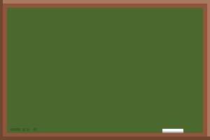
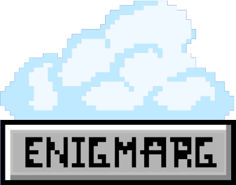
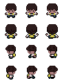

# Changelog

All notable changes to this project will be documented in this file.

The format is based on [Keep a Changelog](https://keepachangelog.com/en/1.0.0/),
and this project adheres to [Semantic Versioning](https://semver.org/spec/v2.0.0.html).

## **v1.0.0** - 20-05-2024

### Added

- Added level rendering using `Tiled` maps
- Added the `Level1` class
- Added the `Level2` class
- Added the `Level3` class
- Added the `Level4` class
- Added the buttons to navigate between levels
- Fixed performance issues with the `Level` class
- Fixed player collision
- Created door collision
- Implemented **pytmx**
- Added `requirements.txt` file
- Added unit tests
- Added the `test` folder
- Fixed out of bounds bug

## ALPHA - 0.2.3 - 19-05-2024 - 20-05-2024

### Added

- Created `Level2` and `Level3`
- Fixed the text overflow in the `Typography` class

## ALPHA - 0.2.2 - 16-05-2024 - 19-05-2024

### Added

- Added the `Typography` class
- Created `Question Pool` class
- Added a mock question pool
- Added the chalkboard sprite
- Added the music to the game
- Added the button to toggle the music

### Images

## ALPHA - 0.2.1 - 02-05-2024 - 16-05-2024

### Added

- Added parallax effect to the background
- Improved Main Menu

## ALPHA - 0.2.0 - 27-04-2024 - 02-05-2024

### Added

- Created `Player` class
- Implemented the player movement
- Implemented the player collision with the walls
- Implemented multiple sprites for the player
- Implemented the player animation
- Implemented UI button calls
- Created first version of the **Main Menu**

### Removed

- Removed `Entity` class
- Removed `Scene manager` class

### Images

## ALPHA - 0.1.1 - 26-04-2024 - 27-04-2024

### Added

- Added UI elements to the game
- Added the `Button` class
- Made the `Button` class clickable
- Fixed the `Scene manager` class to handle the new UI elements

## ALPHA - 0.1.0 - 18-04-2024 - 27-04-2024

### Added

- Fully developed the `Scene manager` class
- Added CI with GitHub Actions
- Refactored the entire code to fit within the new CI pipeline
- Created the transition between scenes using cubic formula
- Created the `Level` class
- Created the first level of the game `Level0`
- Implemented the load level method in the `Level` class

## ALPHA - 0.0.2 - 04-04-2024 - 18-04-2024

### Added

- Improved `README.md` file
- Created the first version of the `Scene manager` class

## ALPHA - 0.0.1 - 25-02-2024 - 04-04-2024

### Added

- First version of the project
- Added the `README.md` file
- Created `Engine` class
- Created `Spritesheet` class
- Created `Entity` class
- Added the first version of the player sprite
- Made the player move with the arrow keys

### Images

